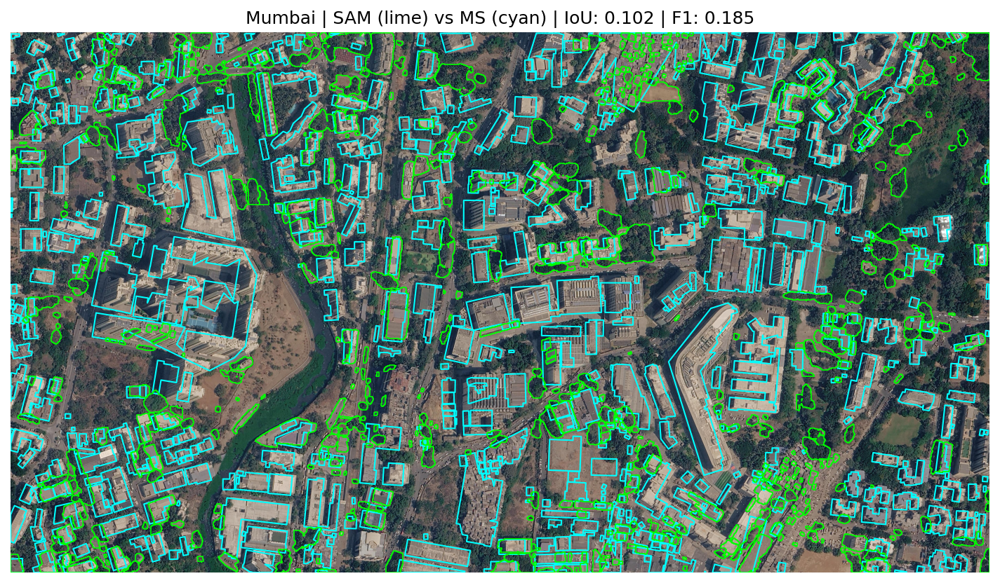
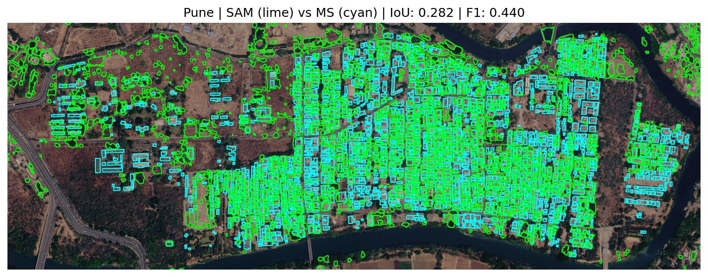
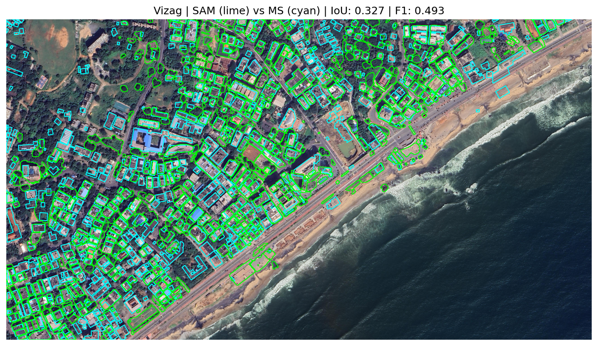

# Rooftop Segmentation using SAM (Segment Anything Model)

This repository contains the solution for the **AI/ML Internship Assignment (Project 1: Rooftop Segmentation)** for Resilience AI.

## 📌 Project Overview
The objective of this project is to perform zero-shot rooftop segmentation on three high-resolution Areas of Interest (AOIs) in India: **Mumbai, Pune, and Visakhapatnam (Vizag)**. 

Instead of training a model from scratch, this pipeline leverages **segment-geospatial (`samgeo`)**, an open-source Python package that adapts Meta's Segment Anything Model (SAM) for geospatial data.

### Key Features of this Approach:
- **High-Res Imagery Sourcing**: Automatically fetches sub-1m Esri World Imagery tiles (Zoom 19) for the provided GeoJSON AOIs.
- **Zero-Shot Segmentation**: Uses the `vit_h` (largest) SAM backbone in automatic grid-point mode as the primary pipeline.
- **Point-Prompted Segmentation (Experimental)**: Explores an alternative approach using known building centroids (from Microsoft's dataset) as positive point prompts for SAM, resulting in higher confidence masks for dense areas.
- **Geospatial Post-Processing**: Filters out noise (cars, roads, bare earth) using a **rectangularity metric** (area/minimum bounding rectangle ratio) and area constraints (15 m² to 3000 m²).
- **Vegetation Filtering**: Computes a green-ratio index from RGB bands to identify and discard tree canopy false positives.
- **Quantitative Evaluation**: Benchmarks the SAM predictions against **Microsoft's Global ML Building Footprints** using pixel-level and instance-level metrics (IoU, Precision, Recall, F1-Score).

---

## 🛠️ Setup & Installation

This project is designed to be run in **Google Colab** (Free Tier with T4 GPU), as it automatically handles CUDA environments and provides enough memory to run the `vit_h` SAM backbone when batching is used.

### Dependencies
The pipeline relies on the following core libraries:
```bash
pip install segment-geospatial leafmap mercantile geopandas rasterio shapely matplotlib pandas
```

---

## 🚀 Execution Instructions

1. **Open Google Colab:** Upload `RooftopSegmentationFinal.ipynb`.
2. **Enable GPU:** Go to `Runtime` > `Change runtime type` and select `T4 GPU`.
3. **Upload Data:** Upload the GeoJSON files from the `dataset/` folder — `dataset1.geojson` (Mumbai), `dataset2.geojson` (Pune), and `dataset3.geojson` (Vizag).
4. **Run All:** The notebook is modularly designed and memory-optimized. Run all cells sequentially. 
5. **Memory Note:** The pipeline uses `gc.collect()` and `torch.cuda.empty_cache()` between AOIs to ensure the Colab Free Tier does not crash during batch segmentation.

---

## 📊 Results Summary

After filtering and vegetation removal, the model's pixel-level segmentation performance against the Microsoft Building Footprints ground truth is as follows:

| AOI | SAM Detections | MS Ground Truth | Pixel IoU | Pixel F1-Score |
|---|---|---|---|---|
| **Mumbai** | 507 | 560 | 0.1022 | 0.1854 |
| **Pune** | 1,572 | 2,282 | 0.2823 | 0.4403 |
| **Vizag** | 486 | 630 | 0.3269 | 0.4928 |

---

## 🖼️ Output Visualizations

### SAM Filtered Rooftops (All 3 AOIs)


### SAM Predictions vs Microsoft Building Footprints (Side-by-Side)


### Overlay Comparison with IoU & F1 Scores


### Per-City Comparison Overlays

| Mumbai | Pune | Vizag |
|---|---|---|
|  |  |  |

---

## 📂 Repository Structure

```
├── RooftopSegmentationFinal.ipynb   # Main notebook (SAM pipeline + evaluation)
├── Roof (1).ipynb                   # Experimental notebook (point-prompted SAM)
├── README.md                        # This file
├── SUMMARY.md                       # Detailed project summary
├── dataset/                         # AOI boundary files
│   ├── dataset1.geojson             # Mumbai
│   ├── dataset2.geojson             # Pune
│   └── dataset3.geojson             # Vizag
└── Output_Visualizations/           # Result images
    ├── all_aois_sam_results.png
    ├── overlay_comparison.png
    ├── sam_vs_ms_side_by_side.png
    ├── mumbai_comparison.png
    ├── pune_comparison.png
    └── vizag_comparison.png
```

---

## 📚 References & Resources

1. **SAM (Segment Anything)**: Kirillov, A., et al. (2023). *Segment Anything*. arXiv:2304.02643. [Link](https://arxiv.org/abs/2304.02643)
2. **Segment-Geospatial (`samgeo`)**: Wu, Q., & Osco, L. (2023). *samgeo: A Python package for segmenting geospatial data with the Segment Anything Model*. [GitHub](https://github.com/opengeos/segment-geospatial)
3. **Microsoft Global ML Building Footprints**: [GitHub](https://github.com/microsoft/GlobalMLBuildingFootprints)
